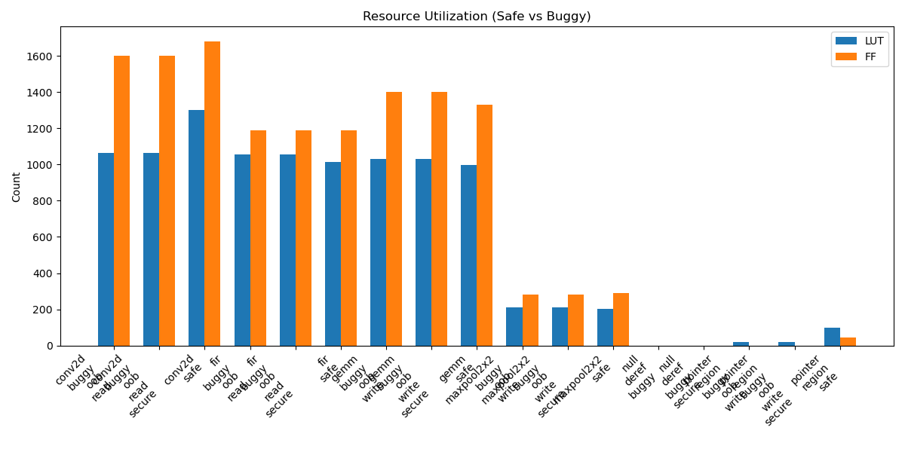

# Vitis HLS Evaluation Report

## Summary
This report demonstrates that **all** kernels, including those with critical memory safety bugs, successfully passed Vitis HLS simulation (`csim`) and synthesis (`csynth`).

| Kernel | Safe? | CSim Result | LUT | FF | DSP | Fmax (MHz) |
| :--- | :---: | :---: | :---: | :---: | :---: | :---: |
| conv2d_buggy_oob_read | ❌ | PASS ⚠️ | 1062 | 1603 | 9 | 457.67 |
| conv2d_buggy_oob_read_secure | ❌ | FAIL | 1062 | 1603 | 9 | 457.67 |
| conv2d_safe | ✅ | PASS | 1300 | 1678 | 9 | 412.54 |
| fir_buggy_oob_read | ❌ | PASS ⚠️ | 1057 | 1190 | 3 | 432.15 |
| fir_buggy_oob_read_secure | ❌ | FAIL | 1057 | 1190 | 3 | 432.15 |
| fir_safe | ✅ | PASS | 1016 | 1188 | 3 | 434.40 |
| gemm_buggy_oob_write | ❌ | PASS ⚠️ | 1032 | 1401 | 6 | 457.67 |
| gemm_buggy_oob_write_secure | ❌ | FAIL | 1032 | 1401 | 6 | 457.67 |
| gemm_safe | ✅ | PASS | 996 | 1332 | 6 | 457.67 |
| maxpool2x2_buggy_oob_write | ❌ | PASS ⚠️ | 209 | 282 | 3 | 513.61 |
| maxpool2x2_buggy_oob_write_secure | ❌ | FAIL | 209 | 282 | 3 | 513.61 |
| maxpool2x2_safe | ✅ | PASS | 204 | 291 | 3 | 508.13 |
| null_deref_buggy | ❌ | FAIL | N/A | N/A | N/A | N/A |
| null_deref_buggy_secure | ❌ | FAIL | N/A | N/A | N/A | N/A |
| pointer_region_buggy_oob_write | ❌ | PASS ⚠️ | 20 | 0 | 0 | 900.09 |
| pointer_region_buggy_oob_write_secure | ❌ | FAIL | 20 | 0 | 0 | 900.09 |
| pointer_region_safe | ✅ | PASS | 99 | 45 | 0 | 301.20 |

## Resource Utilization

Note: The identical or similar resource usage between Safe and Buggy versions confirms that HLS does not insert any implementation cost (overhead) to prevent these bugs, leaving them as open hazards.